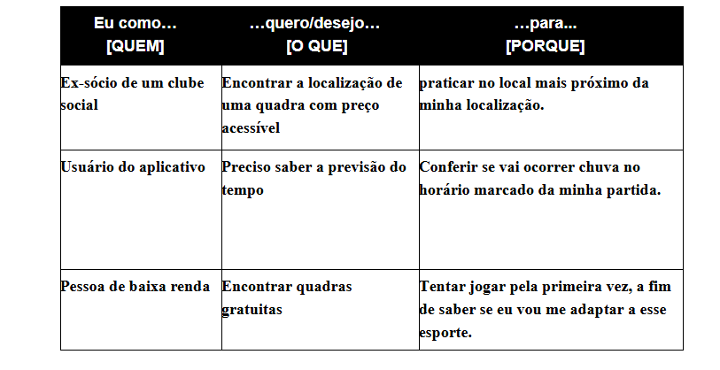

# Especificações do Projeto

## Personas

- Leonardo tem 16 anos, é morador de Belo Horizonte, e durante o seu tempo livre não pratica nenhum esporte. Porém, encontra dificuldades em adaptação para praticar esportes não popularizados, como o tênis. Ele deseja aprender esse esporte e encontrar um local mais próximo a sua residência para treinar.  

- Maria tem 27 anos, é moradora de São Paulo, e por muito tempo frequentava um clube da cidade. No entanto, por questões financeiras não conseguiu se manter sócia do clube e parou de praticar ténis. Ela deseja praticar novamente, mas precisa de um lugar mais acessível no quesito financeiro ou de preferência gratuito.  

## Histórias de Usuários

## Requisitos

As tabelas que se seguem apresentam os requisitos funcionais e não funcionais que detalham o escopo do projeto.

### Requisitos Funcionais

|ID    | Descrição do Requisito | Prioridade |
|------|------------------------|------------|
|RF-001| A plataforma deve permitir o cadastro e login de usuários  | Alta |
|RF-002| A aplicação deve permitir recuperação de senha por e-mail | Alta | 
|RF-003| A aplicação deve fornecer um acompanhamento da previsão do tempo | Alta | 
|RF-004| A aplicação deve permitir o usuário filtrar os valores de uso das quadras, inclusive as gratuitas | Alta | 
|RF-005| A aplicação deve permitir a localização de quadras de tênis de acordo com a localização do usuário | Alta | 
|RF-006| A aplicação deve fornecer detalhes do agendamento realizado | Média | 
|RF-007| A aplicação deve disponibilizar o calendário para o usurário | Média | 
|RF-008| A aplicação deve disponibilizar o agendamento do evento para enviar notificações lembrando o usuário do compromisso com antecedência | Média | 
|RF-009| A aplicação deve permitir convidar e inserir outros usuários dentro do evento para que eles também recebam as notificações de lembretes | Média | 
|RF-010| A aplicação deve mostrar as quadras particulares e direcionar o usuário para o contato com o responsável do clube | Média | 
|RF-011| A aplicação deve ter o ícone para acessar a funcionalidade LIBRAS no canto da página | Baixa | 
|RF-012| A aplicação deve enviar notificações de incentivo a praticar tênis periodicamente | Baixa |
|RF-013| A aplicação deve fornecer ao usuário a disponibilidade de fazer o "check-in" no momento que chegar ao local | Baixa |

### Requisitos não Funcionais

## Restrições

O projeto está restrito pelos itens apresentados na tabela a seguir.

|ID| Restrição                                             |
|--|-------------------------------------------------------|
|01| O projeto deverá ser entregue até o final do semestre |
|02| Não pode ser desenvolvido um módulo de backend        |
|03| Todos do grupo são iniciantes                         |

## Metodologias

As metodologias utilizadas no projeto são SCRUM com controle de tarefas em KANBAN.
