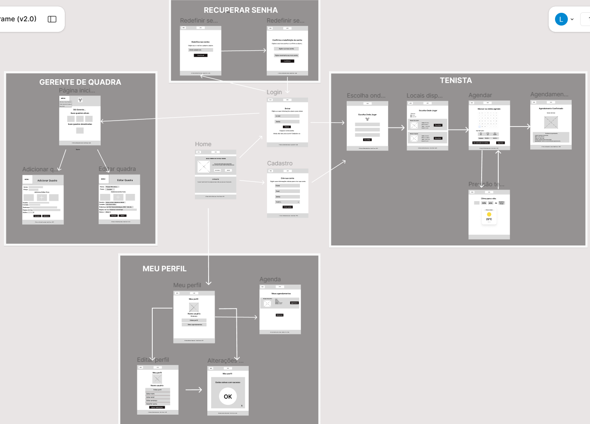
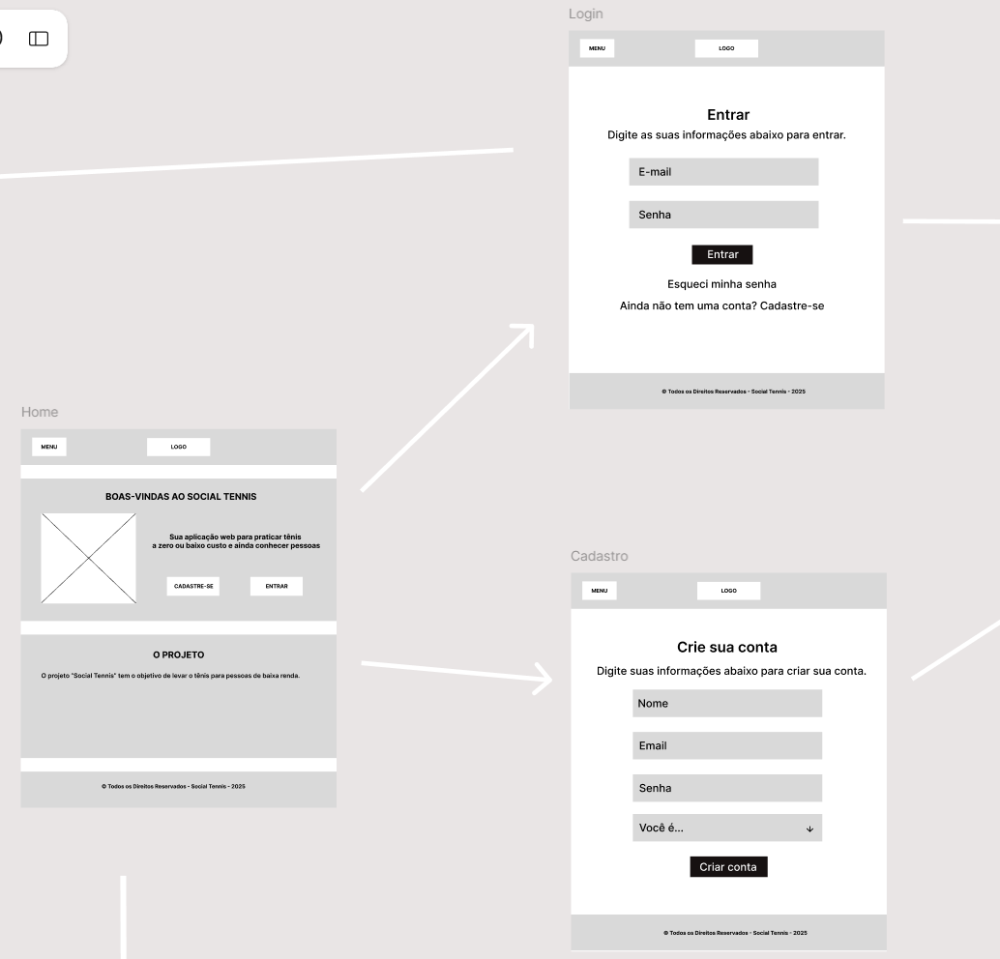
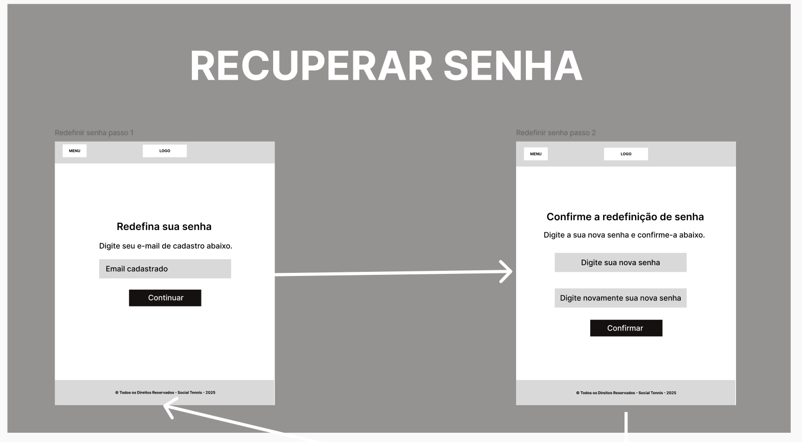
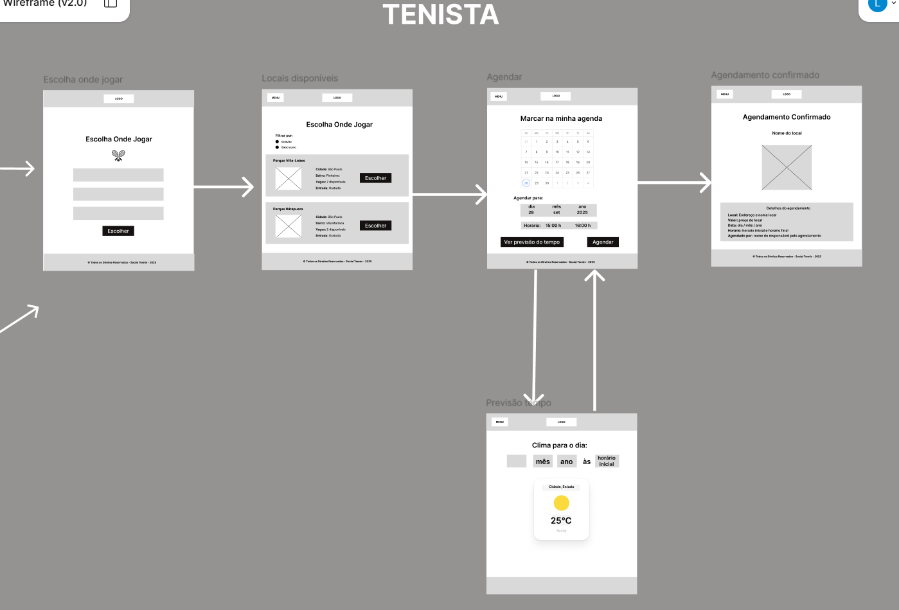
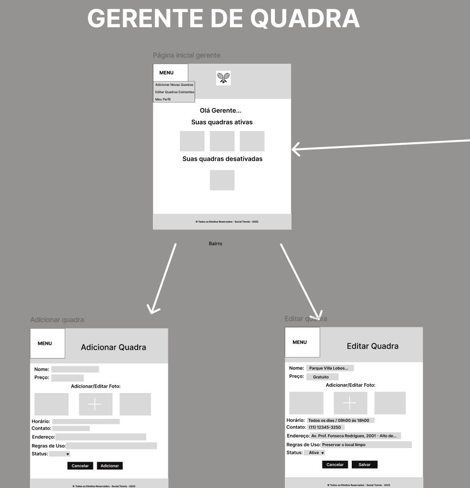
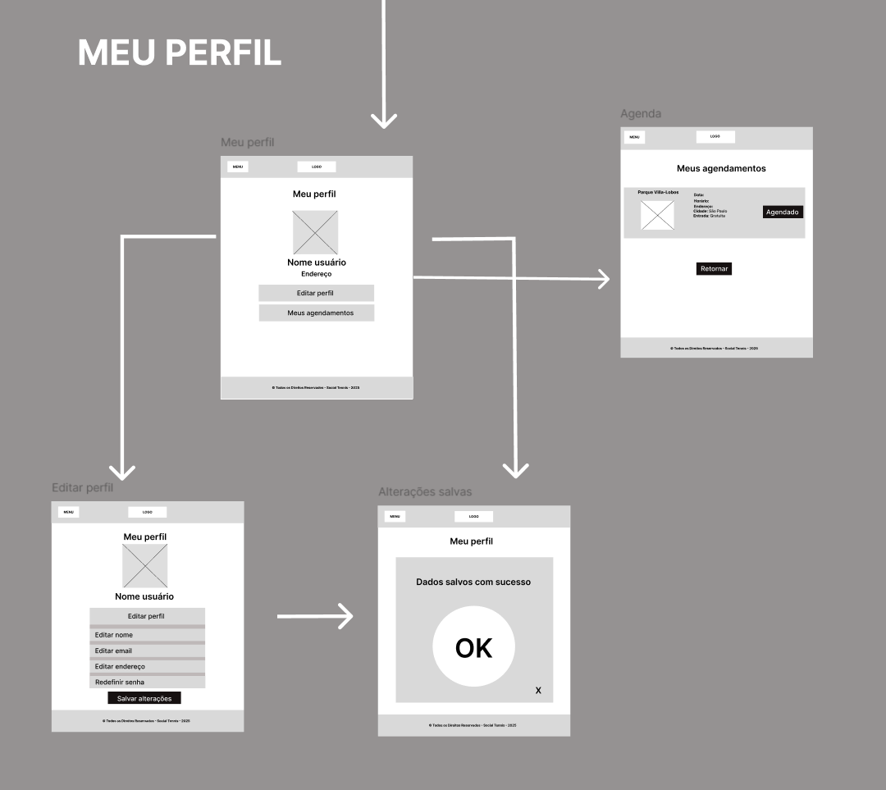

# Social Tennis

.

## Fluxo: Cadastro e Login

Fluxo de cadastro e login do usuário, permitindo criar conta com nome, endereço, e-mail e senha, ou acessar o sistema informando e-mail e senha cadastrados. Inclui recuperação de senha por e-mail, com redefinição mediante confirmação da nova senha. Após autenticação ou cadastro bem-sucedido, o usuário é direcionado à tela de escolha do local para jogar.

.

.

## Fluxo: Escolher Onde Jogar

Fluxo para escolha e agendamento de quadras de tênis, composto por páginas que guiam o usuário desde a seleção da localização até a confirmação do agendamento.

.

## Fluxo: Gerente de quadra
Ao clicar em menu, a pessoa consegue acessar, dentre outras funcionalidades, a previsão do tempo. Nesta sessão, o usuário consegue consultar a previsão do tempo de um dia e horário específico do local selecionado por ele. 

.

## Fluxo: Visualizar e Editar Perfil

Na sessão “meu perfil”, a página permite que o usuário consiga visualizar sua foto de perfil e alguns de seus dados cadastrais, como nome e endereço. Clicando em “editar perfil”, o usuário vai para a sessão em que pode editar todos os seus dados cadastrais, são eles: nome, e-mail, endereço e senha. Depois de salvar as alterações, a aplicação informa que os dados foram salvos com sucesso.

.

