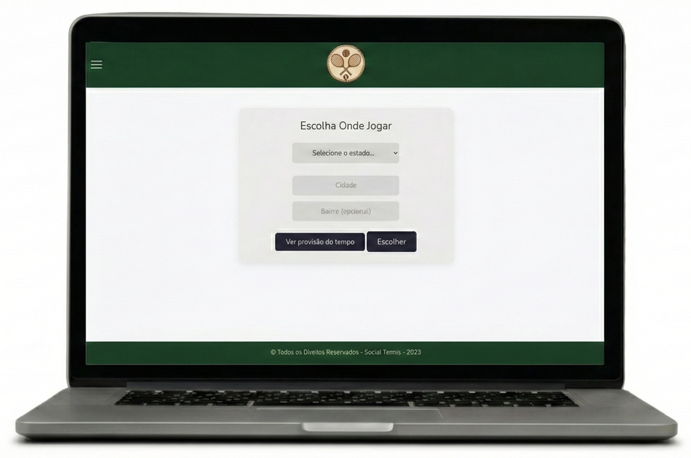
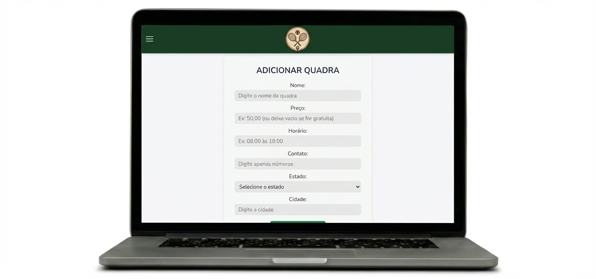
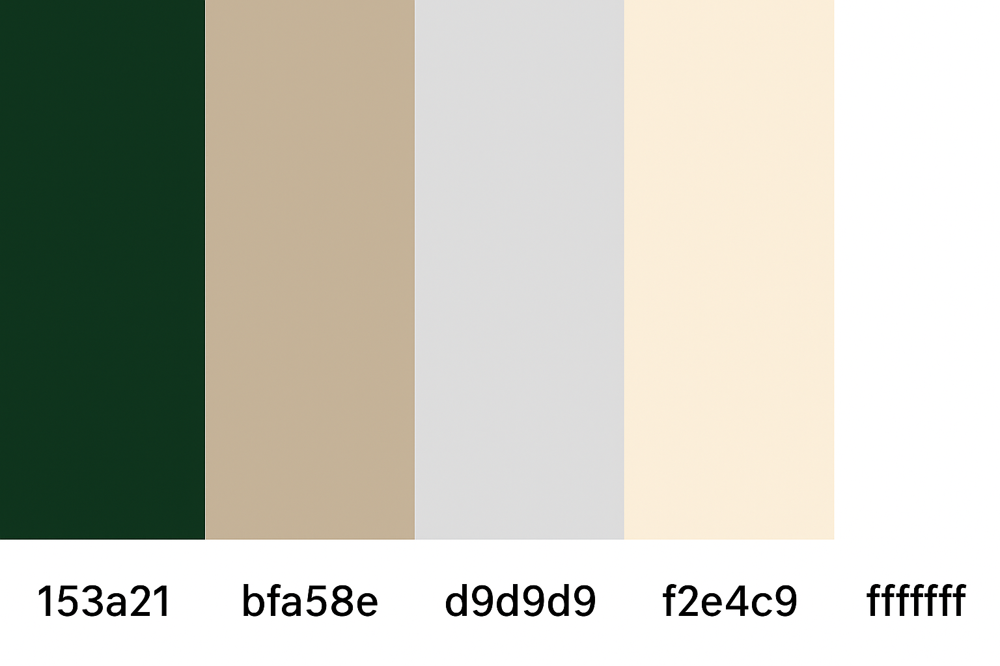
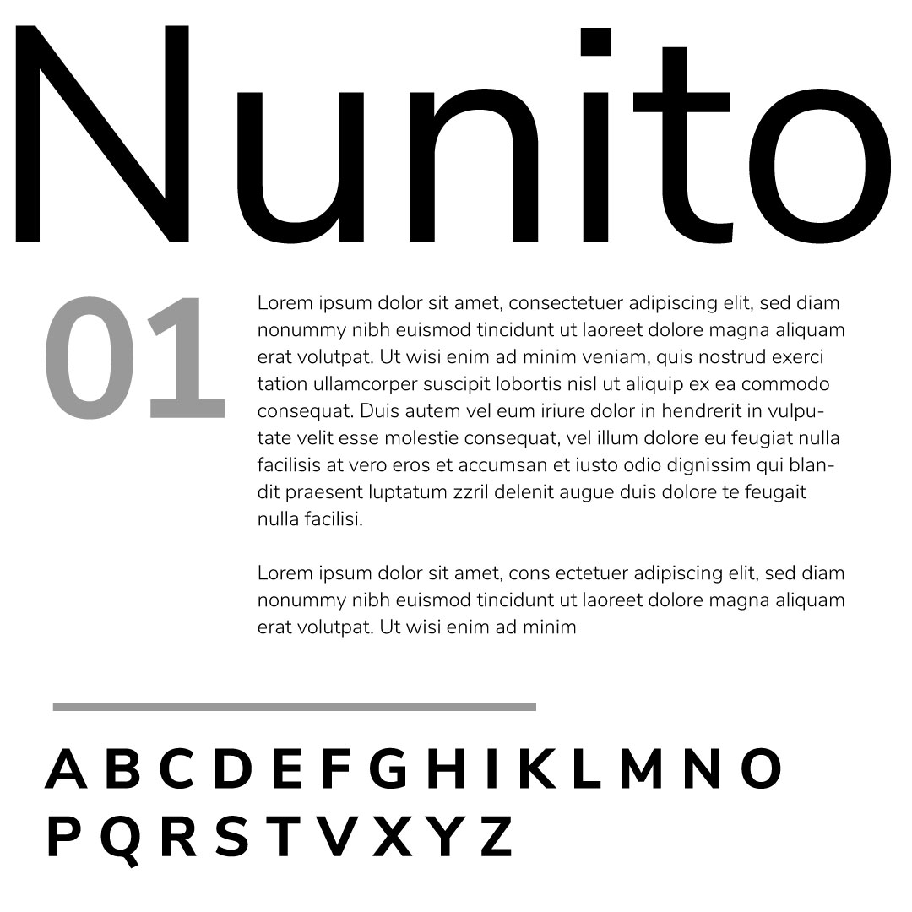

# Template padrão do site

### Página home:

## Design

Detalhe os layouts que serão utilizados. Apresente onde será colocado o logo do sistema. Defina os menus padrões, entre outras coisas.

## Cores

As seguintes cores abaixo foram escolhidas para remeter as quadras de tênis:

## Tipografia

A escolha da fonte "Nunito" foi com o objetivo de trazer modernidade e facilidade na leitura.

## Iconografia

A logo abaixo foi a escolhida por compor raquetes e bola de tênis que remetem a esse esporte e o ícone que traz a ideia de localização das quadras dentro da aplicação.

